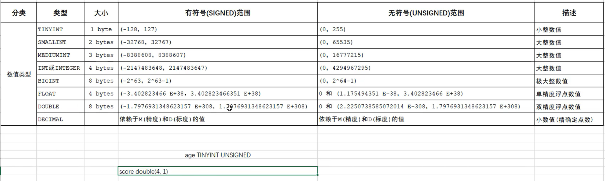
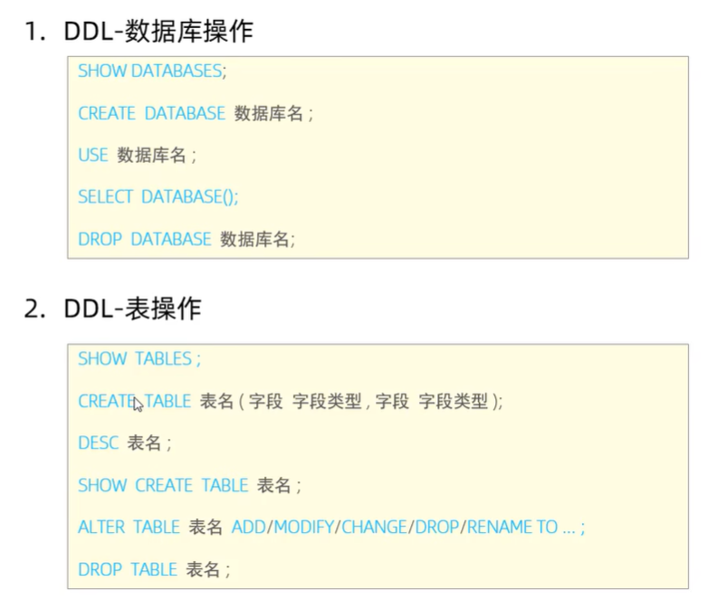
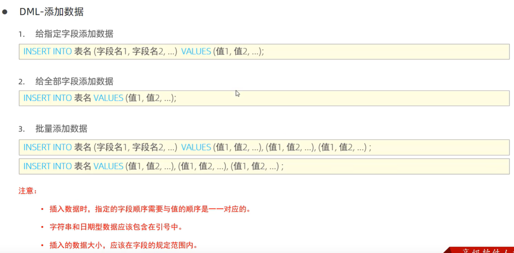
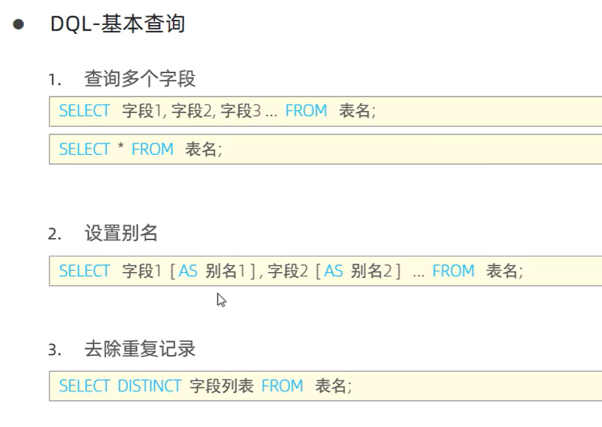

win + r input: services.msc 在系统服务中手动启动mysql

win + r cmd  input: mysql -u root -p 

show databases

creat database  [if not exists 数据库名 ]  [default charset 字符集]  [collate 排序规则] //utf8mb4常用字符集

drop database [if exist 数据库名]  

use 数据库名

select database()

///////////

show tables

desc 'table name'

show create table 'table name'

create table 'table name'(
    字段1 类型  comment '注释',
    字段2 类型 comment '注释'
)comment '注释'

////////

快char()定长字符串  性别
慢varchar()变长字符串   用户名
char(10) 定长10
varchar(10)  最大长10 实际为准

date
time
datetime

CREATE TABLE yuangongxinxi (
    id INT COMMENT '编号',
    worknb VARCHAR(10) COMMENT '工号',
    name VARCHAR(50) COMMENT '姓名',
    gender CHAR(1) COMMENT '性别',
    age TINYINT UNSIGNED COMMENT '年龄',
    idcard CHAR(18) COMMENT '身份证',
    entryd DATE COMMENT '入职日期'
) COMMENT '员工表';

///////////////

alter table 指定表 add 字段 类型 comment '注释'

alter table 指定表 change 旧 新 类型 comment '注释'

alter table * drop * comment  ''

alter table * rename to * comment ''

drop table [if exists ] *;

truncate table * ;  删掉在重新生成新表里边数据都没了

- 注释放在一个创建的对象后编

//////////

# 查询
